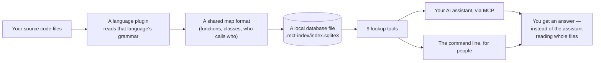

# How it works

This document explains what happens inside `mini-consumes-tokens` (`mct`), in plain language. You don't need to read any code to follow it — it's written for anyone curious about how the pieces fit together and why they were built this way.

If you're looking for installation or usage instructions instead, see [README.md](README.md).

---

## The big picture, in one sentence

Your code goes in once, a searchable map comes out, and from then on your AI assistant (or you, through the command line) asks that map questions instead of re-reading files every time.

---

## How information flows through the system

Walking through each step:

1. **Your source code files** — nothing about your project changes; this system only reads it.
2. **A language plugin reads that language's grammar** — a small, dedicated component understands the real structure of that one programming language (not just guessing from text).
3. **A shared map format** — whatever language the plugin just read, the result is translated into the same simple shape: "here's a function/class, here's its name and location, here's what it calls."
4. **A local database file** — that shared map is stored on your own machine, in one plain file, using the same well-known storage format (SQLite) regardless of which languages your project uses.
5. **9 lookup tools** — a small, fixed set of questions this map can answer quickly (listed below).
6. **Your AI assistant, via MCP, or the command line, for people** — either an AI assistant asks these questions automatically as it works, or you ask them yourself from a terminal.
7. **You get an answer instead of the assistant reading whole files** — the whole point: a precise answer to a precise question, without scanning or re-reading anything unnecessary.

---

## The five main building blocks

### 1. The shared rulebook

This is the part of the system that doesn't know anything about any specific programming language, about the database, or about how AI assistants talk to it. Its only job is to define the common "shape" that everything else has to agree on: what a function definition looks like, what "X calls Y" looks like, and so on.

Think of it like a standard shipping container size: once something is packed into a standard container, the same trucks, cranes, and ships can move it — no matter what's actually inside. This shared rulebook is that standard container for code.

### 2. The language plugins (one per language)

Each of the 16 supported languages has its own small, self-contained "translator" that knows how to read that specific language's real grammar and package what it finds into the shared shape from step 1. Rust, Python, Java, C#, Kotlin, JavaScript/TypeScript, C++, Go, HTML, CSS, XML, XAML, Bash, PowerShell, PHP, and Markdown (headings plus [[WikiLink]]/#tag relations) each have one of these.

A 17th plugin, for Lua, also exists in the project — but purely as a proof that the design works: it demonstrates that a brand-new language can be added without changing anything else in the system. It isn't part of the tools you actually connect your assistant to.

Because each language gets its own separate, self-contained plugin, adding support for a new language never requires touching the shared engine underneath it — someone just writes one new, focused translator. It also means unusual or broken code is handled safely: if a plugin runs into something it can't make sense of in one file, it reports that gracefully and moves on. A problem in one file, in one language, can't take down indexing for the rest of your project.

### 3. The local database

Whatever language wrote the code, the result always lands in the same single local file, using one shared layout — not a different storage scheme for every language. That's what makes a question like "who calls this function" work identically no matter what language answered it: one set of logic to maintain, not sixteen separate ones.

This database also keeps track of what's changed since the last time it looked, using the same kind of fingerprinting that version control (Git) already relies on — so re-scanning a project after a small change only looks at what's actually different, not the whole project from scratch. And by default, it deliberately skips over anything that looks like a secret (password files, API keys, credential files, and similar), so those never end up copied into the index.

### 4. The question-answering layer

This is the part that an AI assistant actually talks to. It offers nine specific kinds of questions:

- **What's defined in this file or folder** — useful for browsing when you don't know an exact name yet
- **Where exactly is this thing defined**
- **Every place this thing is used**, anywhere in the project — the broadest search
- **What does this function depend on** — what it calls
- **What depends on this function** — the reverse question, who calls it
- **If I change this, what's likely to break** — one combined answer instead of asking three separate questions
- **What does this file look like overall**, without showing everything inside it — useful for getting the shape of a large file cheaply
- **Refresh what you know about the code** — normally happens automatically
- **Is your information complete and up to date** — a health report

Some of these questions can also be asked "one step further" — for example, not just "who calls this function" but "and who calls those callers, and who calls those" — up to a safe limit, so a question can never accidentally loop forever. When an answer would be very long, it comes back in manageable pages instead of one enormous block of text.

### 5. The command line

This is the human-facing side of the same system: build the first index for a project, force a refresh, check on its health, or connect an AI assistant to it — all without needing an AI assistant involved at all.

---

## A worked example: "who calls this function?"

1. Your AI assistant sends that question to the local question-answering layer.
2. It looks up that function's relationships in the local database — no file reading involved.
3. If you asked it to go further ("and who calls those callers?"), it follows that chain a limited number of additional steps, so it can't run away indefinitely.
4. If there turn out to be a lot of results, they come back in manageable batches rather than all at once.
5. The answer comes back as a short, structured piece of text — a small fraction of the size of every file that happened to mention that function.

---

## How we keep it trustworthy

- **Every change is automatically built and tested on Windows, macOS, and Linux** before it's accepted — not just "works on my machine."
- **A strict rule against ever letting unexpected input crash the program** while it's reading someone else's code. Since this tool reads code from any repository — including code nobody has specifically checked — parsing problems are always handled gracefully instead of being allowed to bring anything down.
- **An automatic security scan** checks everything this project depends on for known vulnerabilities.
- **Each language plugin is deliberately fed large amounts of unusual, broken, or adversarial-looking input** in short automated sessions, specifically to catch crashes before a real user ever would.
- All of this is backed by **261 automated tests** across the project.

---

For how to install and use this project, see [README.md](README.md). For details on contributing, including how to add support for a new language, see [CONTRIBUTING.md](CONTRIBUTING.md).
