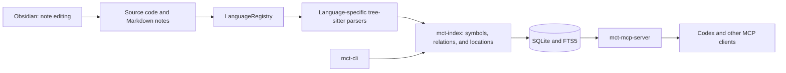

# GPT Report — mini-consumes-tokens audit

Date: September 29, 2026. Audited commit: `1880048dd8274b0b3a7f82b07bedd3219bde5ca1`, branch `feat/incremental-indexing-issue-25`.

## Follow-up status — October 2, 2026

This is a historical audit with a follow-up status, not a claim that every task is complete. Source locations and original reproduction results below refer to the audited commit unless a dated status states otherwise.

- F02 was integrated into `main` by PR #99.
- F03, F04 and the demonstrated F07 Rust cases have passing regression evidence.
- F05/F06: PR #100 was merged into `codex/audit-relations` after PR #99; its Markdown implementation, not the failing local opaque-link patch, reached `main` through PR #101 (merged 2026-10-02, `3732075`), which closed #98. Alias/title wikilink resolution and block anchors are not implemented.
- R01: all 17 parsers use bounded iterative error traversal, with dedicated depth-budget regressions.
- F09: the installation example sets `INSTALL_DIR` on the installer process; a local release fixture verifies that the real installer writes both executable binaries to the selected directory, including paths containing spaces. No remote installer or release was downloaded.
- F01 owner-confirmed credential revocation, F08 duplication, R02–R04 measurements/diagnostics, the real semantic-model run, the tokenizer/workflow benchmark and issue #74 corpus completion remain outstanding.

Workspace verification on the PR #101 branch (`codex/verified-audit-fixes`): **886 passed, 0 failed, 11 ignored**, run outside the sandbox on 2026-10-02. The three new Rust depth regressions and the Markdown note-graph/MCP cases are included. Ignored tests were not newly disabled by this change. The standalone installer fixture test and release document/archive smoke also passed. Strict all-target/all-feature Clippy passed with warnings, unwrap, expect and panic denied. Formatting and whitespace checks passed. The quality evaluation passed with accuracy 1.000 and no baseline regressions. Fresh CLI/STDIO MCP smoke passed with 18 tools, Lua retrieval, Markdown note context and inline-code exclusion. The original dirty checkout was preserved; these results apply to the follow-up PR branch based on `main` at `58b5c90`. Private notification scripts and personal agent configuration are excluded from this PR. Third-party notice and license assets are retained so release packaging remains valid.

## 1. Assessment

The project has a useful technical foundation: separation between parsers, index, and transport; parameterized queries; per-file transactions; integration tests; quality evaluation; incremental indexing; and compact responses. **It does not need a rewrite. It does need more accurate relations and complete documentation support before it can be presented as reliable context for automated refactoring.**

The current product is primarily **an MCP server and a Rust CLI**, not a standalone skill. SQLite stores symbols and relations extracted by tree-sitter. Agents call structured tools and do not need to write SQL. Obsidian is one way to organize and edit the Markdown files in `docs/`; it is neither the index engine nor a dependency for finding functions.

The MCP server **was already connected and working in this Codex session** and was used for this audit. Its implementation or connection does not need to be duplicated.

Priorities:

1. Remove and rotate the local plaintext credential; prevent Codex configuration from being added to Git accidentally.
2. Do not present ambiguous relations as resolved dependencies; fix exclusion reload behavior.
3. Register Lua and make Markdown notes queryable context units.
4. Improve dead-code signals and expand evaluation with this report's adversarial cases.
5. Reduce duplication and measure scalability after correctness is established.

This report provides research and proposals. It does not modify product code, MCP contracts, the SQL schema, credentials, or existing configuration.

## 2. Scope, method, and limitations

The review covered the workspace structure and its 23 crates: 17 parsers and 6 infrastructure components. It examined language registration, indexing and exclusions, SQL queries, relation traversal, composite context, Markdown, dead-code heuristics, semantic search, the watcher, CLI, and evaluation. Parser coverage was structural; **this was not a line-by-line review of every grammar or syntax case**.

Code exploration used `get_file_tree`, `get_project_overview`, `list_symbols`, `get_file_skeleton`, `build_context_pack`, `find_references`, and `find_dead_code`, preferably grouped with `batch`. Documents and configuration were also reviewed directly. SQLite was never opened with external tools.

Reproductions ran against `mct-mcp-server` and `mct-cli` in separate temporary directories. The helper program only created fixtures and sent JSON-RPC to the server; it did not read tables or inspect source code outside the MCP. Observed behavior was compared with definitions in the checkout. The installed binary was not verified to be byte-for-byte identical to the audited commit; reproduce these cases against a freshly built binary before turning them into CI regressions.

Initial repository index state:

- 318 files, 6,138 symbols, 16 languages with indexed files.
- 7 syntax errors, all in intentionally malformed fixtures under `tests/corpus/malformed/`; these are not production errors.
- 38 manifests and 220 declared dependencies, with 64 unique external dependencies according to the server summary.
- `.codex/` and `AGENTS.md` were already untracked before the audit and were preserved.

These numbers describe the snapshot before this report was added. Source locations refer to the audited commit above.

### Validation performed

| Check | Result |
|---|---|
| `scripts/unix/check.sh --only test`, outside the sandbox | **762 passed, 0 failed, 17 ignored** |
| Script Clippy check, workspace, all targets and features, warnings/unwrap/expect/panic denied | **OK** |
| `cargo fmt --all --check` | **OK** |
| `mct-eval`, 27 cases, 5 iterations | Accuracy 1.000, MRR 0.900, 100% success, no regressions |
| Watcher tests outside the sandbox | 9 passed, 0 failed |

The first restricted run stopped before completing the suite, after 642 tests passed, 2 failed, and 15 were ignored. Both failures involved file events; they disappeared outside the sandbox, and the full suite passed. **They are not classified as confirmed watcher bugs.**

Local toolchain: Rust 1.98.1; CI pins 1.96.0. The Linux/Windows matrix was not reproduced, and no new `cargo-audit` or fuzzing runs were performed. Clippy with all features is not equivalent to running all tests with those features. The real semantic model was not downloaded and exercised end to end.

## 3. Architecture and practical value



| Component | Responsibility and observations |
|---|---|
| `mct-core` | Symbol, location, and relation models plus the `LanguageParser` contract; keeps SQLite, tree-sitter, and MCP concerns separate. |
| `mct-lang-*` | Language-specific AST traversal. Graph quality depends on the relations each parser extracts. |
| `mct-index` | Persistence, FTS, queries, exclusions, incremental indexing, and semantic search. |
| `mct-mcp-server` | Argument validation, formatting, context composition, and watcher. |
| `mct-cli` | Initialization, status, JSON registration, exclusions, dead-code candidates, and `probe`. |
| `mct-eval` | Evaluation against fixtures and a baseline; demonstrates stability for those cases, not universal correctness. |
| `mct-corpus` | Shared long-corpus test harness and coverage tracking. |

Definitions include paths, start/end lines, and other metadata. Distinguish **declaration location** from **semantic resolution of a use**: exact source ranges do not identify which method a call targets.

Strengths to preserve:

- `query_relations` binds SQL arguments as parameters: `crates/mct-index/src/queries.rs:471–500`.
- `write_parsed_file` replaces symbols and relations in one transaction: `crates/mct-index/src/indexer.rs:744–835`.
- Indexing checks canonical paths and rejects symlink escapes: `indexer.rs:142–164`.
- A syntax error removes stale symbols and records the issue transactionally: `indexer.rs:277–296`.
- The watcher recovers through full reindexing and backoff; its real tests pass outside the sandbox.
- Project overview output is bounded; the `crates` overview reported truncation at 24,000 bytes and suggested narrowing the path.

## 4. Confirmed findings

Priorities: **P1** affects trust, data, or core operation; **P2** affects coverage or maintenance; **P3** is minor debt. No remotely exploitable vulnerability or P0 failure was demonstrated.

### F01 — P1: credential in local configuration and file at risk of being committed

**Status (2026-10-01):** The ignored `.mcp.json` no longer contains an inline token; its GitHub server entry is retained with an empty `env` map, so the parent environment must provide `GITHUB_PERSONAL_ACCESS_TOKEN`. On 2026-10-01, GitHub CLI reported its stored credential as invalid, and `.codex/config.toml` is absent. The previous token appeared in tool output during the follow-up review and must be revoked; credential rotation requires a handoff to the account owner. The evidence below describes the earlier state.

**Evidence:** `.mcp.json` and `.codex/config.toml` contain a plaintext GitHub credential. Its value is not reproduced here. `git check-ignore` identifies `.mcp.json` as ignored, but not `.codex/config.toml`; `git status` shows `.codex/` as untracked.

**Impact:** a broad configuration read may expose the secret in context, and a broad `git add` may include the Codex file in the repository. This local condition was confirmed; publication to Git and token validity were not verified.

**Fix:** rotate or revoke the credential, remove it from both files, and use the client's credential mechanism or environment variables. Commit only a sanitized configuration template. Add a secret check before publishing changes. Do not remove the complete working configuration.

**Acceptance:** no literal token in shareable files; the connection still works with an externally supplied credential; a secret check rejects test credential fixtures. Rotation requires an account action and was not performed in this audit.

### F02 — P1: name-based relations produce false dependencies

**Status (2026-10-05): Design issue [#97](https://github.com/Zubiarka8/mini-consumes-tokens/issues/97) is implemented on `main` through PR #99 (`58b5c90`); [ADR-002](docs/01-architecture/adrs/002-qualified-relation-resolution.md) records the as-built design and its deviations from [`docs/superpowers/specs/2026-10-01-qualified-relation-identity-design.md`](docs/superpowers/specs/2026-10-01-qualified-relation-identity-design.md).** Qualified target evidence, explicit ambiguity and resolved symbol identities replace arbitrary name-based destination selection. Historical reproductions below describe the audited commit.

**Locations:** `crates/mct-mcp-server/src/server.rs:833–851`, `:1359–1383`, `:1454–1455`; `crates/mct-index/src/queries.rs:388–399`; `crates/mct-index/src/traversal.rs:22–57`; `crates/mct-lang-rust/src/lib.rs:322–336`.

**Reproduction:**

```json
{"tool":"build_context_pack","args":{"symbol":"query_relations","path":"crates/mct-index","source_lines":50,"limit":10}}
```

The result reports `Ok` from a C# corpus, `get` from PHP, and `map` from C++ as callees of the Rust function. These are not dependencies of the audited function.

**Cause:** the parser keeps only the final segment of qualified calls; queries search by name, and `pick_definition` may choose the first available definition if no local one is found. BFS also identifies nodes by name. Context-pack filters constrain starting definitions and some relations but do not resolve destination identity. The code itself acknowledges this approximation.

**Impact:** misleading context, false-positive impact results, and search pollution between fixtures and production code. Setting `path` helps, but does not fully solve same-name symbols in one file or external dependencies.

**Proposed fix:** preserve each reference's qualification and scope; resolve candidates by language, module, and type; and represent destinations as resolved, ambiguous, or external. Until resolution is reliable, show uncertain candidates instead of assigning an arbitrary definition. Do not connect languages without an explicit relation that justifies it.

**Acceptance:** fixtures for `A::run`, `B::run`, `std::...`, same-file homonyms, and multilingual repositories; no unrelated dependency presented as resolved. Per `AGENTS.md`, begin any model/schema change with an issue and design.

### F03 — P1: `reindex(force=true)` does not reload `.mctignore` in the running server

**Status (2026-10-02): Implemented and verified. Exclusion-reload index tests passed; all 11 watcher tests passed outside the sandbox, including live ignore-rule reload.** `Index::reindex` reloads exclusions before walking, and the server watcher reloads them when `.mctignore` or `.gitignore` changes, then schedules a full reindex. The reproduction below describes the earlier state.

**Locations:** `crates/mct-mcp-server/src/main.rs:43–45`, `:64–69`; `crates/mct-index/src/indexer.rs:94`; `crates/mct-mcp-server/src/server.rs:1496–1505`.

**Isolated reproduction:**

1. Create `hidden.rs` containing `pub fn audit_hidden_symbol() {}`.
2. Start the server and initialize MCP.
3. Add `hidden.rs` to `.mctignore` after startup.
4. Call `reindex` with `force: true`.
5. Search for `audit_hidden_symbol`; it still appears at `hidden.rs:1`.

The server reindex response was `1 parsed, 0 removed, 2 symbols written`. Running `mct-cli --root <fixture> reindex --force` separately did remove the file (`1 removed`); `status` then showed zero files and symbols.

**Cause:** exclusions are created at startup and reused by both the index and watcher. `force` invalidates hash checks; it does not reload that configuration.

**Impact:** adding an exclusion does not remove content from the running server's query results.

**Fix:** reload rules when `.mctignore` changes and on a full reindex; update the index and watcher consistently and remove newly excluded records. Include `.gitignore` changes when importing those rules is enabled.

**Workaround:** restart or reconnect MCP after changing exclusions. **Acceptance:** the fixture no longer returns the symbol without a restart; also test removing an exclusion and invalid rules.

### F04 — P2: Lua is implemented and tested but is not connected to the product

**Status (2026-10-05): Resolved on `main` through PR #91 (commit `11df400`).** Both production registries register `mct_lang_lua::LuaParser` (CLI and MCP server). On 2026-10-02, a fresh CLI indexed a temporary Lua fixture and a fresh MCP server retrieved its `greet` definition. The earlier missing-registration evidence below is historical.

**Locations:** `crates/mct-lang-lua/src/lib.rs:20–66`; `crates/mct-cli/src/main.rs:150–169`; `crates/mct-mcp-server/src/registry.rs:9–28`.

The workspace contains `mct-lang-lua`, but both `build_registry` functions register 16 parsers and omit Lua. With a fixture where `sample.lua` defines `greet`, status does not show Lua and `find_symbol("greet")` returns no definitions. Lua is not reported as pending either; the indexer's pending-language list covers Swift and Ruby.

**Impact:** implemented code that users cannot access through CLI/MCP. Do not delete it as “decorative”; connect it or explicitly mark it experimental.

**Fix:** add dependencies and registration in both executables, then verify parity. **Acceptance:** `probe`, indexing, and MCP queries for `.lua` work end to end with the production registries; manually constructing a Lua registry in a test is insufficient.

### F05 — P1 for the Obsidian use case: the index does not model a note as a unit

**Status (2026-10-05): Design issue [#98](https://github.com/Zubiarka8/mini-consumes-tokens/issues/98) is implemented on `main` per [`docs/superpowers/specs/2026-10-01-markdown-note-graph-design.md`](docs/superpowers/specs/2026-10-01-markdown-note-graph-design.md) (see its "Implementation notes").** The PR #100 implementation reached `main` through PR #101 (merged 2026-10-02, `3732075`), which closed #98. Notes, section ranges, metadata and path-scoped links have dedicated parser, index and MCP regression tests. Historical reproductions below describe the audited commit.

**Locations:** `crates/mct-lang-md/src/lib.rs:85–118`, `:428–464`; `crates/mct-mcp-server/src/server.rs:1599–1603`.

Reproductions with four notes:

- `no-heading.md`, whose content is `[[beta]]`, is indexed as a file but contributes no symbols or links.
- `setext.md`, with a title underlined by `===`, also contributes no symbols in this test.
- In `alpha.md`, `[[beta]]` before the first `#` is absent from relations, while the same link inside a section appears.
- `tags: [audit]` in frontmatter does not produce `tag:audit`.
- `get_project_overview({"path":"docs"})` returns only the header and omits notes because they have no supported top-level symbols. The same behavior occurs in the repository's `docs/00-system`.

**Cause:** ATX headings are extracted as `Element` symbols without a root note symbol; paragraphs need a `parent_id` to emit relations. Overview symbol selection does not include them. The parser does not convert YAML properties into searchable metadata.

**Impact:** notes, backlinks, and properties relevant to architectural context are missing. A heading outline does not automatically retrieve section content: the observed context pack for `Alpha title` omitted the full body.

**Fix:** create a stable per-note symbol identified by path; model ATX and Setext headings as children; define section ranges; capture tags and aliases from frontmatter; include notes/headings in summaries. Keep Markdown interpretation in its parser and avoid spreading Obsidian logic through the generic index.

**Acceptance:** notes with no H1, no headings, Setext headings, aliases, and frontmatter appear in search/summaries and retain their links. Open an issue before changing `LanguageParser`, the schema, or public signatures.

### F06 — P2: wikilinks in code and anchors without note identity pollute the graph

**Status (2026-10-05): Core implementation merged into `main` through PR #101 (`3732075`), with explicit limitations.** The earlier opaque-target patch is superseded by the complete PR #100 implementation that PR #101 integrated. Code spans are excluded; note and heading relations carry note-path evidence; links and embeds retain distinct kinds. Alias/title metadata is indexed, but resolving wikilinks by alias/title and block anchors remains outside the implemented scope.

**Locations:** `crates/mct-lang-md/src/lib.rs:203–244`, `:376–403`; definition selection in `server.rs:833–851`.

In the fixture, a paragraph containing only inline code `` `[[ghost]]` `` creates a reference to `ghost`. Also, `[[beta#Shared]]` becomes two separate targets, `beta` and `Shared`. Since `alpha.md` also contains `## Shared`, the context pack selects that local heading even though the link points to the heading in `beta.md`.

**Impact:** false backlinks and navigation to the wrong note. Inline-code handling is acknowledged as a limitation in comments but remains relevant to the described product.

**Fix:** parse inline nodes while excluding code and preserve the combined note/anchor identity before resolving links. Keep links and embeds distinct if navigation needs that distinction.

**Acceptance:** inline code creates no references; notes with the same section title are not confused; aliases, relative paths, local anchors, and `.md` extensions are covered by tests.

### F07 — P2: “dead code” includes used functions and active tests

**Status (2026-10-02): The reported Rust cases are covered by passing regressions.** Test harness functions, function values and macro uses no longer produce the demonstrated false candidates. The tool remains a heuristic, not proof that code is safe to delete.

**Locations:** `crates/mct-index/src/dead_code.rs:95–110`; `crates/mct-index/src/indexer.rs:784–818`.

**Evidence in the project itself:** `symbol_kind_str` appears among the unreferenced candidates even though `write_parsed_file` calls it inside `params![...]` at `indexer.rs:791`. The index does not capture this macro use.

**Minimal fixture:**

```rust
pub fn actual_use() {}
pub fn entry() { let _f = actual_use; }
#[cfg(test)]
mod tests {
    #[test]
    fn verifies_behavior() { assert_eq!(1, 1); }
}
```

`find_references("actual_use")` returns no references, and `find_dead_code({"path":"a.rs"})` includes both `actual_use` and `verifies_behavior`. The heuristic does not recognize a function used as a value or the `#[test]` attribute.

**Impact:** risk of recommending incorrect deletions. The tool does state that it is heuristic; keep that notice and provide evidence for each candidate.

**Fix:** identify tests by attributes/scope, model references used as values, and improve extraction from known macros. Show coverage/confidence and compare with compiler diagnostics. Global names can also hide genuinely dead code through collisions.

**Acceptance:** neither example above is presented as safe to delete; no process deletes code solely because it has zero references. This audit did not confirm a list of removable production functions.

### F08 — P2: structural duplication encourages drift

**Status (2026-10-02): Partially addressed.** CLI/MCP registry parity and shipped-language coverage tests now pass, preventing the demonstrated missing-registration drift. Parser traversal/location duplication remains; no shared AST utility refactor is included here.

**Confirmed:** language registrations are duplicated in the CLI and server; `first_error` is identical in Rust (`lib.rs:78–89`), Python (`:79–90`), and C++ (`:94–105`). Location and traversal patterns also repeat across other parser skeletons; repository-wide duplication has not been quantified.

**Impact:** support changes and infrastructure fixes must be repeated. The historical missing Lua registration illustrated that risk; the current parity and coverage regressions now provide an automatic guarantee for the distributed registries.

**Fix:** share language composition or use a catalog that generates/verifies both registries. For AST utilities, consider a separate crate that depends on tree-sitter; **do not add tree-sitter to `mct-core`**. Share only operations that are genuinely identical; do not force a universal parser.

**Acceptance:** adding a language requires one effective declaration or fails a parity/coverage check; parsers retain independent behavior tests.

### F09 — P3: installation example assigns the variable to the wrong process

**Status (2026-10-01): Resolved.** The README now sets `INSTALL_DIR` on the `bash` process that runs the installer. The previous example is retained below as the historical finding.

**Location:** `README.md:162`.

```sh
INSTALL_DIR=/usr/local/bin curl -sSL ... | bash
```

The assignment applies to `curl`, not to the `bash` process running the installer. The custom directory may be ignored. Assign the variable to the installer process, for example `curl ... | INSTALL_DIR=/path bash`, or run a previously downloaded script with the variable set.

**Acceptance:** a test with a temporary directory installs into the selected destination. The installer destination was verified on 2026-10-02 using a local release fixture without network access. The remote release itself was not downloaded or installed.

## 5. Observed risks that still require measurement

Do not present these as reproduced failures or confirmed vulnerabilities.

### R01 — Unbounded recursion while finding the first error

**Status (2026-10-05): Resolved on `main` through PR #101 (commit `648e87c`).** All 17 language parsers now use an iterative tree-cursor walk capped by `MAX_TRAVERSAL_DEPTH`; no recursive call stack is used to locate the error node. If the syntax error lies deeper than the limit, the parser falls back to the root location instead of reporting its exact line. Three Rust depth regressions pass: an error beyond the budget falls back to the root, later shallow errors remain reachable, and deep valid input has no error node. The depth-budget assertion failed against the old recursive implementation before the fix. No actual stack overflow was reproduced.

The inspected `first_error` implementations recursively walk the tree without the main walker's depth limit. The limits documentation cites `MAX_TRAVERSAL_DEPTH = 256`, but this does not automatically protect the error-search path. Test deeply nested malformed input in subprocesses; prefer iterative traversal with a budget. **No stack overflow was reproduced.**

### R02 — Output pagination does not imply bounded SQL queries

`query_relations` materializes all query results before returning them; `bfs` receives that vector before applying its budget. `build_context_pack` computes related definitions and signatures before the presentation limit. A small `limit` may reduce tokens without proportionally reducing CPU, memory, or I/O.

Test repositories with 10,000/100,000 symbols and high-fan-in names. Push budgets into SQL where semantics allow, and measure memory/latency while preserving deterministic pagination.

### R03 — Semantic search holds index access busy

`server.rs:1082–1115` holds the mutex while loading the model and updating embeddings. `semantic_ranking` (`crates/mct-index/src/semantic.rs:434–484`) scans vectors in scope, sorts them, and then truncates the result. Large indexes may see latency and blocked concurrent queries.

Measure cold/warm startup and concurrency before introducing a vector index or more complex architecture. Move expensive computation outside critical sections and use bounded top-k when measurements justify it.

### R04 — Incomplete reporting of read failures

`indexer.rs:211–215` skips an unreadable file without recording a diagnostic; `:177–185` also omits some manifest-read errors. The health summary reports syntax errors and pending languages, but does not prove that every previously readable file remains accessible or that every manifest is current. Add a fixture that changes file permissions and verify expected behavior; do not declare the index healthy solely because `last_indexed_at` exists.

## 6. Token savings: measured results and gaps

The local evaluation reports:

- 27 cases; accuracy 1.000 and MRR 0.900.
- Aggregated responses: approximately 5,486 tokens.
- Catalog: approximately 7,698 tokens.
- Local latency p50/p95/max: 0.06 / 0.29 / 1.85 ms; index construction: 56.9 ms, **for the evaluation fixture**, not all repositories.

`mct-eval::approx_tokens` (`crates/mct-eval/src/lib.rs:316–333`) uses a word/character heuristic, not an OpenAI model tokenizer. These values compare runs using the same method; **they do not demonstrate billed Codex savings or a universal 90% reduction**.

Measure savings as the cost of the complete task:

```text
catalog + arguments + responses + follow-up reads + retries
```

Add a benchmark with an identified tokenizer and two workflows that solve the same tasks: conventional reading/search versus MCP. Measure location/relation accuracy, incorrect answers, input/output tokens, and total time. Compare cold starts with multiple queries that amortize the catalog cost. Evaluate `batch`, `toon`, and context packs separately.

Progressive tool discovery does not by itself reduce what a client loads: savings from `discover_tool_categories`/`get_tool_schema` require the client to use that mechanism. The repository documentation notes that a standard MCP handshake still advertises every tool.

### Do not inherit old conclusions without rechecking them

`research.md` analyzes a September 18 commit. This audit confirms subsequent improvements: bounded overview, brief dependency summary, pruning with `filter_entry`, path-based updates, FTS queries used in search, and relation writes without the former `to_symbol_id` resolution in `write_parsed_file`. Do not reopen its old findings automatically as if all were still current. Qualified relation identity is implemented through PR #99; Markdown context improvements from PR #100 reached `main` through PR #101.

## 7. Codex usage and integration

### Verified state

`mct-cli` and `mct-mcp-server` are available in `$HOME/.cargo/bin/`. The local project configuration already declares the server with `--root` pointing to this repository. MCP calls during the review confirmed it works. That entry was neither changed nor duplicated.

### Reproducible configuration for another project

Codex supports STDIO servers using `command` and `args` in TOML and provides `codex mcp add`. Project-level configuration is used in trusted projects. Source: [official Codex MCP documentation](https://learn.chatgpt.com/docs/extend/mcp?surface=cli), checked September 29, 2026.

Sanitized `.codex/config.toml` example; replace the paths:

```toml
[mcp_servers.mini-consumes-tokens]
command = "/absolute/path/mct-mcp-server"
args = ["--root", "/absolute/path/project"]
```

Alternatively, register the server with the CLI:

```sh
codex mcp add mini-consumes-tokens -- mct-mcp-server --root /absolute/path/project
```

`mct-cli mcp-register` writes **JSON to `.mcp.json`**, as confirmed by `crates/mct-cli/src/main.rs:269–318`; it does not generate this TOML configuration. Onboarding could offer a Codex-specific target and merge its entry without overwriting existing servers.

Recommended agent workflow:

1. Check health once at startup; distinguish fixture errors from production errors.
2. Use a crate-bounded tree/overview and `list_symbols` to discover names.
3. Call `build_context_pack` with `path`, `language`, few related symbols, and 40–80 source lines.
4. Verify ambiguous relations before changing or deleting code; name matching is not type resolution.
5. Group known queries with `batch` and use `toon` for comparable listings.
6. Read/edit files required for a change as directed by `AGENTS.md`; do not open SQLite directly.
7. `main` reloads exclusions during reindex and when the watcher detects ignore-file changes; index and live-watcher regressions verified this behavior on 2026-10-02.

A future skill could package this workflow and its budgets. It should be an instruction layer over the existing MCP, not a duplicate indexer or context database. The project now includes local skills; the earlier manifest observation described the audit snapshot only.

## 8. Hardening plan and completion criteria

### Delivery A — trust and working integration

- Resolve F01 and ensure that only sanitized configuration is committed.
- [x] Verify exclusion reload through index and live-watcher regressions (F03).
- [x] Register Lua in both production registries, resolving F04 (verified through fresh CLI indexing and MCP retrieval on 2026-10-02).
- Preserve the current behavior that removes stale symbols after syntax errors.

### Delivery B — graph accuracy

- [x] Opened design issue [#97](https://github.com/Zubiarka8/mini-consumes-tokens/issues/97) and drafted [`docs/superpowers/specs/2026-10-01-qualified-relation-identity-design.md`](docs/superpowers/specs/2026-10-01-qualified-relation-identity-design.md) for qualified identities and reference resolution (F02); implementation was merged through PR #99.
- [x] Treat ambiguity as an explicit result with candidates and provenance (PR #99).
- Add tests for homonyms, external libraries, callbacks, macros, and inline tests.
- [x] Add qualified-relation evaluation cases that penalize false dependencies (PR #99).

### Delivery C — usable Obsidian context

- [x] Opened design issue [#98](https://github.com/Zubiarka8/mini-consumes-tokens/issues/98) and drafted [`docs/superpowers/specs/2026-10-01-markdown-note-graph-design.md`](docs/superpowers/specs/2026-10-01-markdown-note-graph-design.md) for note identities, sections, properties, and compound links (F05/F06); implementation from PR #100 was integrated into `main` by PR #101.
- [x] Improve the existing context/overview tools without adding a dedicated note-context tool (PR #100 implementation).
- [x] Keep note names, titles and aliases distinct and use paths to resolve collisions; alias/title-based wikilink lookup remains unsupported.
- [x] Add regressions for note edits, renames, deletions and backlink updates.

### Delivery D — maintenance and performance

- Resolve confirmed duplication (F08) without violating crate boundaries.
- Complete the long-fixture corpus. `internal/corpus-progress.md` reports **7 done, 0 in PR, and 10 pending** after confirming PR #83 and PR #88 are merged on 2026-10-02.
- Measure R02–R04 with explicit budgets and diagnostics; R01's bounded traversal has passing depth-budget regressions.
- [x] Fix the installation example (F09). Update remaining documentation tied to actual contracts.

Any schema, `LanguageParser` contract, or public MCP signature change requires a prior issue. Future PRs should be small, include a reproduction that fails before and passes after, and update corpus tracking when relevant. Do not refresh the baseline to hide an accuracy regression.

## 9. Evidence and reproductions

Local logs from this run, generated under `target/` and not intended for version control:

- `target/script-logs/check-test.log`: full test suite outside the sandbox.
- `target/script-logs/check-clippy.log`: strict lint check.
- `target/script-logs/check-eval.log`: metrics and cases.
- `target/script-logs/gpt-audit-repro.log`: Markdown, Lua, and false dead-code candidates.
- `target/script-logs/gpt-ignore-repro.log`: reindexing with stale exclusions.

Script logs may be overwritten by later runs, so this document records the essential results and fixtures.

Primary Markdown fixture used for F05/F06:

```markdown
---
tags: [audit]
aliases: [AliasAlpha]
---
[[beta]]
# Alpha title
First paragraph.

[[beta#Shared]]

`[[ghost]]`

## Shared
Some useful content.
```

The `beta.md` note contains `# Beta title`, a blank line, `## Shared`, and a paragraph. Other notes contain `[[beta]]` without a heading, and a Setext heading followed by `[[beta]]`. The Lua fixture is `function greet()`, `print("hello")`, `end`. The server is initialized over the temporary directory and queried with `list_symbols`, `get_project_overview`, `find_references`, `find_dead_code`, `find_symbol`, and `build_context_pack`.

**Technical conclusion:** declaration locations and the test infrastructure already provide value. The next quality gains should prevent incorrect context and retrieve complete notes with reliable links. Token reduction is useful when it preserves the information needed to make a correct decision.
